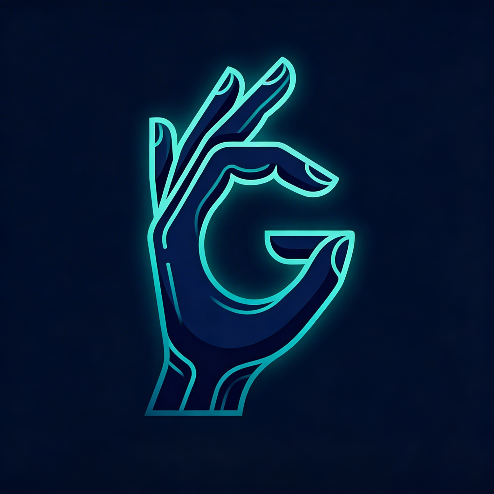

# Gestura — Real-Time ASL Translator



> A full-stack AI-powered American Sign Language translator built from scratch. Sign a letter in front of your webcam and see it translated instantly.

🌐 **Live at:** [gestura.up.railway.app](https://gestura.up.railway.app) *(coming soon)*  
⭐ **Star this repo if you find it useful!**

---

## What is Gestura?

Gestura is a real-time ASL alphabet translator that uses a custom-trained LSTM neural network to recognize hand signs directly from your webcam. No external AI APIs. No pre-built models. Everything — from the training pipeline to the React frontend — was built from scratch.

---

## Features

- 🤟 **Real-time ASL detection** — 29 signs (A-Z + space, del, nothing)
- 🧠 **Custom LSTM model** — trained on 87,000 images, 98.2% accuracy
- ✋ **MediaPipe hand tracking** — 21 landmark coordinates per frame
- ⚡ **Sub-200ms inference** — FastAPI backend with live webcam feed
- 📝 **Sentence builder** — auto-add letters, copy, share
- 📖 **ASL Reference guide** — all 26 letters with images
- 💾 **Session history** — saves past signed sentences
- 👍 **Accuracy feedback** — thumbs up/down on predictions
- 🔗 **Share card** — share your signed sentence

---

## Tech Stack

| Layer | Technology |
|-------|-----------|
| ML Model | PyTorch LSTM |
| Hand Tracking | MediaPipe |
| Backend | FastAPI + Uvicorn |
| Frontend | Next.js + React + TypeScript |
| Styling | Inline CSS (Gestura design system) |
| Containerization | Docker |
| Deployment | Railway (backend) + Vercel (frontend) |

---

## Project Structure
asl-translator/
├── backend/
│   ├── api/
│   │   └── main.py          # FastAPI server
│   └── model/
│       ├── model.py         # LSTM architecture
│       ├── preprocess.py    # MediaPipe landmark extraction
│       └── train.py         # Training pipeline
├── frontend/
│   └── app/
│       ├── page.tsx         # Landing page
│       ├── about/           # About page
│       ├── blog/            # Blog page
│       ├── contact/         # Contact page
│       ├── reference/       # ASL reference guide
│       ├── opensource/      # Open source page
│       └── app-page/        # Live translator app
├── data/
│   ├── raw/                 # ASL Alphabet dataset (87K images)
│   └── processed/           # Landmarks CSV + trained model
├── Dockerfile               # Backend container
├── requirements.txt         # Python dependencies
└── docs/
└── project-foundation.md

---

## Phases

| Phase | Description | Status |
|-------|-------------|--------|
| Phase 1 | Project setup, environment, Git | ✅ Complete |
| Phase 2 | Data preprocessing, model training, FastAPI | ✅ Complete |
| Phase 3 | Full website + app UI | ✅ Complete |
| Phase 4 | Docker + Railway + Vercel deployment | ✅ Complete |

---

## Getting Started

### Prerequisites
- Python 3.10+
- Node.js 18+
- conda

### Backend Setup
```bash
conda activate asl-translator
cd Desktop/asl-translator
uvicorn backend.api.main:app --reload --host 0.0.0.0 --port 8000
```

### Frontend Setup
```bash
cd frontend
npm install
npm run dev
```

Open `http://localhost:3000` in your browser.

### Docker (optional)
```bash
docker build -t gestura-backend .
docker run -p 8000:8000 gestura-backend
```

---

## Model Details

- **Architecture:** 2-layer LSTM (input=63, hidden=128, classes=29)
- **Dataset:** ASL Alphabet — Kaggle (87,000 images, 29 classes)
- **Preprocessing:** MediaPipe Tasks API → 21 landmarks → 63 normalized coordinates
- **Training:** 30 epochs, MPS (Apple Silicon), 80/20 split
- **Test Accuracy:** 98.23%

---

## Built By

**Manav Kheni**  
[LinkedIn](https://www.linkedin.com/in/manav-kheni-678368383/) · [GitHub](https://github.com/manavkheni1)

---

## License

MIT — free to use, modify, and distribute.
